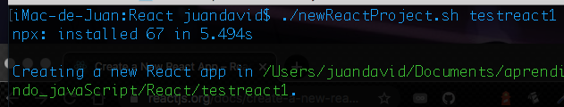

# Instalación de React
Acceder a la pagina https://reactjs.org/docs/getting-started.html dentro de la pagina buscar: *Create a New React App*, buscar: Create React App, lo cual lo llevara a la siguiente linea de codigo:

> npx create-react-app my-app 
> cd my-app 
> npm start

npx es un comando de ejecución de Node.Js, el cual se instala por https://nodejs.org/es/
___

# Crear un nuevo proyecto
Para crear un nuevo proyecto, usar el script nombrado newReactProject.sh de la siguiente manera:

 1. `./newReactProject.sh + nombre aplicación`
 Si el archivo no ejecuta, es necesario establecer permisos con el comando `chmond +x newReactProject.sh`
 

al terminar la ejecución del comando se crea una carpeta que contiene el proyecto de react.
NOTA: React no trabaja con HTML, sino que trabaja con puro JS